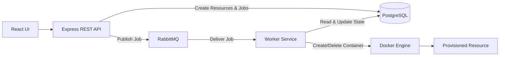
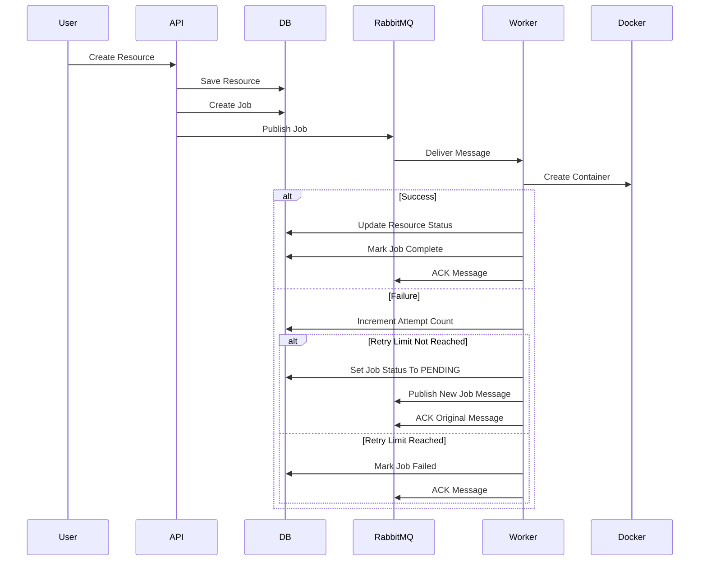
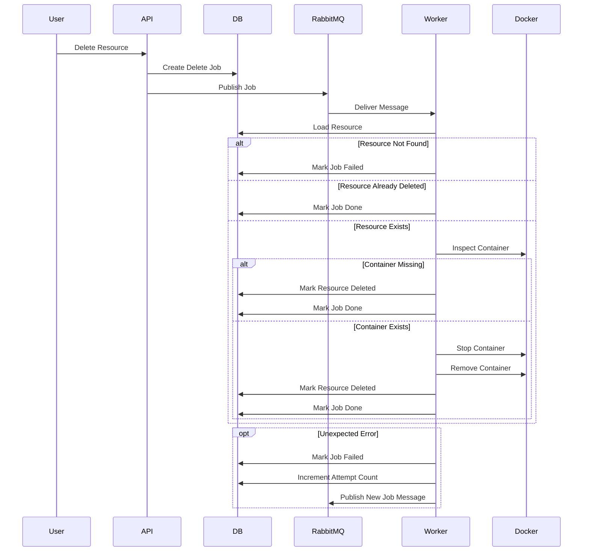
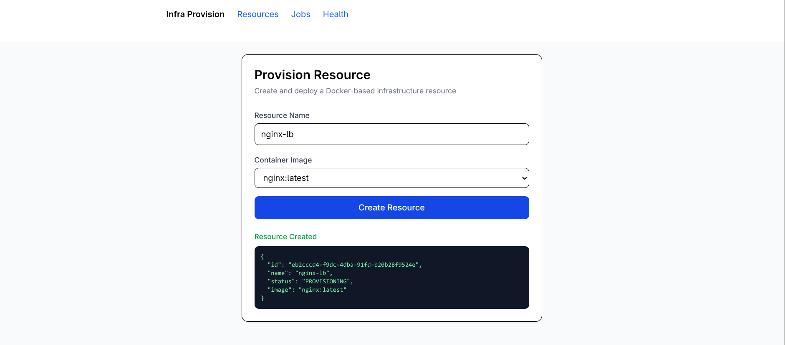
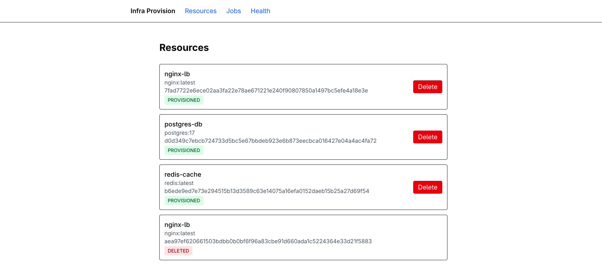
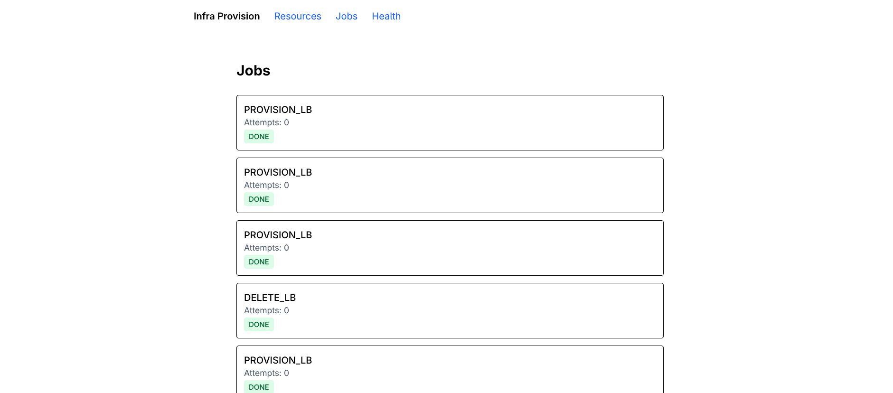
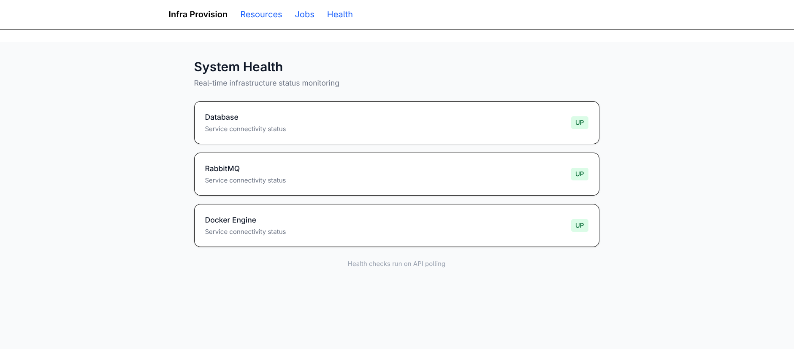

# Infra Provision

Infra Provision is an asynchronous infrastructure automation platform that provisions and manages Docker containers through REST APIs, message queues, and background worker services.

The platform persists resource and job state in PostgreSQL, dispatches infrastructure operations through RabbitMQ, and executes container lifecycle workflows using dedicated worker processes. By decoupling API requests from infrastructure execution, the system provides reliable job orchestration, retry-aware processing, and fault-tolerant resource management.

This project explores backend engineering concepts including asynchronous processing, distributed job execution, idempotent workflows, state management, infrastructure automation, and container orchestration.

---

<details>
<summary><strong>Table of Contents</strong></summary>

- [Running Locally](#running-locally)
- [Core Capabilities](#core-capabilities)
- [Architecture](#architecture)
  - [Components](#components)
- [REST API](#rest-api)
  - [Resource Endpoints](#resource-endpoints)
  - [Job Endpoints](#job-endpoints)
  - [Health Endpoint](#health-endpoint)
- [Provisioning Workflow](#provisioning-workflow)
  - [Provision Resource](#provision-resource)
- [Deletion Workflow](#deletion-workflow)
  - [Delete Resource](#delete-resource)
- [Technology Stack](#technology-stack)
- [Resource Lifecycle](#resource-lifecycle)
- [Job States](#job-states)
- [Health Monitoring](#health-monitoring)
- [Screenshots](#screenshots)
- [WIP](#wip)

</details>

---

## Running Locally

### 1. Start Infrastructure

```bash
docker compose up -d
```

### 2. Start API

```bash
cd api
pnpm install
pnpm dev
```

### 3. Start Worker

```bash
cd api
pnpm worker
```

### 4. Start Frontend

```bash
cd web
pnpm install
pnpm dev
```

---

### Core Capabilities

* Provision Docker containers from predefined resource templates
* Asynchronous job execution using RabbitMQ
* Background worker architecture
* Retry-aware job processing
* Idempotent resource provisioning and deletion workflows
* Complete resource lifecycle management from provisioning to deletion
* Job tracking and monitoring
* Infrastructure health monitoring
* Docker Compose local development environment

---

## Architecture



### Components

| Component           | Responsibility                       |
| ------------------- | ------------------------------------ |
| React UI            | Resource creation and monitoring     |
| Express REST API    | Request validation and orchestration |
| PostgreSQL          | Persistent resource and job storage  |
| RabbitMQ            | Asynchronous job queue               |
| Worker Service      | Background job execution             |
| Docker Engine       | Container provisioning and deletion  |

---

## REST API

The Express API acts as the orchestration layer between the frontend, PostgreSQL, and RabbitMQ.

### Resource Endpoints

| Method | Endpoint | Description |
|---------|----------|-------------|
| POST | `/resources` | Create a resource |
| DELETE | `/resources/:id` | Delete a resource |
| GET | `/resources` | List resources |

### Job Endpoints

| Method | Endpoint | Description |
|---------|----------|-------------|
| GET | `/jobs` | List jobs |

### Health Endpoint

| Method | Endpoint | Description |
|---------|----------|-------------|
| GET | `/health` | Check infrastructure health |

---

## Provisioning Workflow



### Provision Resource

1. User submits a provisioning request.
2. API validates the request.
3. Resource metadata is persisted.
4. A provisioning job is created.
5. The job is published to RabbitMQ.
6. A worker consumes the message.
7. Docker provisions the container.
8. Resource and job status are updated.

---

## Deletion Workflow



### Delete Resource

1. User requests resource deletion.
2. API creates a deletion job.
3. Job is published to RabbitMQ.
4. Worker consumes the message.
5. Docker removes the container.
6. Resource and job status are updated.

---

## Technology Stack

### Backend

* TypeScript
* Node.js
* Express
* PostgreSQL
* RabbitMQ
* Dockerode

### Frontend

* React
* TypeScript
* Vite
* Tailwind CSS

### Infrastructure

* Docker
* Docker Compose

---


## Resource Lifecycle

| State          | Description                        |
| -------------- | ---------------------------------- |
| `PROVISIONING` | Container creation in progress     |
| `PROVISIONED`  | Container successfully provisioned |
| `DELETING`     | Container removal in progress      |
| `DELETED`      | Resource removed                   |

---

### Job States

| State        | Description                                 |
| ------------ | ------------------------------------------- |
| `PENDING`    | Waiting in queue                            |
| `PROCESSING` | Being executed by worker                    |
| `DONE`       | Successfully completed                      |
| `FAILED`     | Retry limit exceeded or unrecoverable error |

---

## Health Monitoring

The platform exposes a health endpoint that verifies:

* PostgreSQL connectivity
* RabbitMQ connectivity
* Docker Engine connectivity

Example response:

```json
{
  "status":   "ok",
  "database": "up",
  "rabbitmq": "up",
  "docker":   "up"
}
```

---


## Screenshots

### Dashboard



### Resources



### Jobs



### Health Monitoring



---

## W.I.P

- [ ] WebSocket-based real-time updates
- [ ] Benchmarks
- [ ] Retries for failed jobs
- [ ] OpenAPI integration
- [ ] CI/CD
- [ ] Tests
